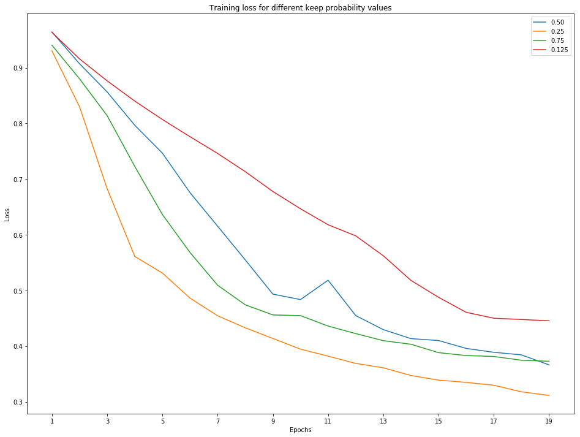
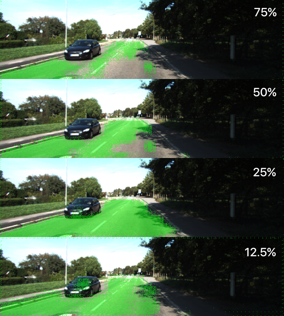
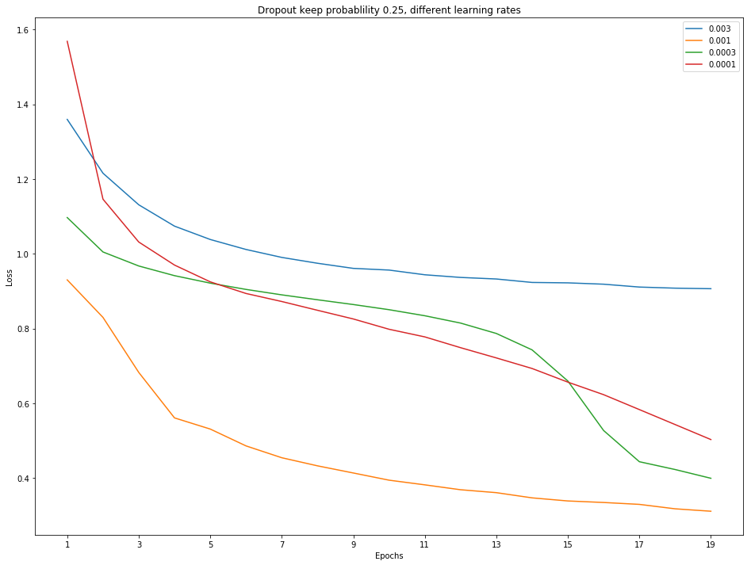
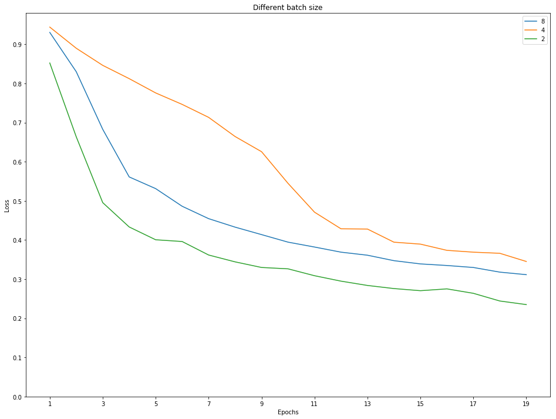
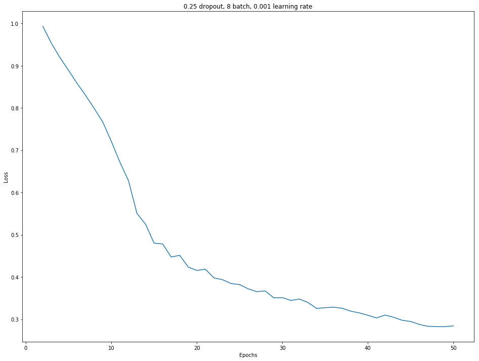

# Semantic Segmentation
Self-Driving Car Engineer Nanodegree Program

---

### Introduction
The goal of this project is to use a Fully Convolutional Network (FCN) to label the pixels of a road in images.

### Setup
You can see detailed information on dependencies installation and build instructions in parent repository [here](https://github.com/udacity/CarND-Semantic-Segmentation).

### Algorithm description
As suggested by the learning materials for this projects I've used pre-trained `VGG16` networked and then instead of fully connected classifier layer at the end added several layers to upscale the output back to image dimensions and get an FCN network.

Then this network is trained on training image set using binary classification (`road` and `not-road`) for each pixel of the image.

Main code structure was already provided in `main.py` file, I only had to implement several functions to make project running. Here are several words about each of them.

#### `load_vgg`

This function loads pre-trained `VGG16` network, finds important layers we will need to use later to build our FCN. These layers are:

- Input layer, which gets the source pixel data
- Keep probability layer, which defines probability when some of the connections are kept or dropped during traning (which is a very effective way to fight overfitting)
- Three output layers, the last one of which we will start our upscaling network part from and the other two will be used as skip connections to the upscale layers (which improves network capability to recognize features on different scales)

#### `layers`

In this function we build the actual FCN from loaded `VGG16` network.

First we add 1x1 convolution layers on top of each `VGG16` output layers we build upon (this does basically what fully-connected layer does, but with preserving spatial information). 

Then we upscale each layer and then add it to the one before it (thus creating the skip connections).

And we return the final layer as a result of this function.

#### `optimize`

This function does layer reshaping and constructs the final loss function, optimizer and training operation to train the network.

#### `train_nn`

This function calls the actual training by cycling through epochs and feeding the network training images one batch at a time. It also prints out and saves the losses after each batch for each epoch to use later for evaluating network training performance.

#### `run`

Run is the main function which calls all the other functions to load, build, prepare for training and train our FCN. And at the end the trained network is applied to test images so we can see how well it performs.

### Selecting training parameters

As the network architecture is fixed we can tune a few meta-parameters to get the best performance out of our network. There parameters are:

- Number of training epochs: increasing it will train the network better on the training set, but at the same time we risk increased overfitting
- Training batch size: larger batch size means faster training, but at the same time it can mean less number of network coefficient values updating per epoch
- Learning rate: higher values will mean faster training, but if it is too high our network might miss the optimum get worse results than with slower training
- Dropout keep probability: decreasing this value is a great way to fight overfitting, but if too low (with high probability of ignored connections) the network might not have enough complexity in its structure to make the necessary generalizations

To start the tuning the following values were chosen for these parameters: `20` epochs, `8` batch size (the largest size without out-of-memory crashes on my training machine), `0.001` learning rate and `0.5` keep probability for dropout.

#### Choosing keep probability

With all the other meta-parameters fixed I did several training runs with `0.125`, `0.25`, `0.5` and `0.75` keep probability. Here how the mean loss for the epoch looked like for each of the values.

As you can see, keep probability `0.25` is the best. `0.75` is also better than `0.5`, but it is probably due to the overfitting and we always keep the lowest value to be protected from it.

To be sure here are several examples of how these 4 keep probability rates perform on the test images:

As expected, even though `0.75` keep probability was better than `0.5` during training it is definitely worse on testing. And `0.125` generalizes too much and includes many non-road pixels in the result.

So we pick `0.25` keep probability for the dropout layers.

#### Choosing learning rate

Now to choose the better learning rate I've tried values `0.0001`, `0.0003`, `0.001` ans `0.003`.

Based on these results we keep learning rate `0.001`.

#### Choosing batch size

Since initial batch size was initially at the maximum possible value the values chosen for the batch size were: `8`, `4` and `2`.

Batch size `4` appears to be performing worse than `8`. `2` is slightly better, but it took much more time to train with the same number of epochs, so we're staying with `8` batch size.

#### Choosing number of epochs

The best way to choose the number of epochs would be to designate the part of training data as a validation set and keep training until validation loss is decreasing together with training loss. Since we're not doing this we can try to rely on the moment when training loss decreasing starts slowing down. You can see this on the plot below:

As you can see loss drops rapidly until 18-20 epochs and then it slows down. The last big drop is around 34 epochs, this is what we will choose for the final training.

### Results

You can see the results of the final training run in `results` folder.
